# Macro Keypad (3x3 +1)

A 3x3 macro keypad with RGB backlighting, an optional rotary encoder and a little display, powered by an **Arduino Pro Micro**. Nine keys, five modes, and enough shortcuts to make your coworkers think you've finally learned Excel.

  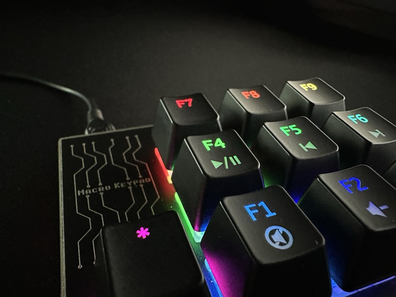

> ### Check ALL the photos before you start!
> Some components on this board are placed in unusual ways (the LEDs and the Pro Micro go on the **back** of the PCB). The photos and renders below are the assembly guide, so look at every one of them **before** you heat up the soldering iron. Desoldering a Pro Micro is not a fun weekend activity.

## MAIN FEATURES :

- **9 MX-style mechanical switches** in a 3x3 grid, plus a **mode button** (the "+1").
- **10 SK6812 Mini-E RGB LEDs** – one under each key plus one for the mode key, reverse-mounted so they shine up through the switches.
- **Arduino Pro Micro (ATmega32u4)** – shows up on your computer as a real USB keyboard and mouse. No drivers, no software, no excuses.
- **Optional rotary encoder** in place of switch 1 – volume control in the default mode.
- **Optional display** – a 0.91" 128x32 OLED on the board, or a 20x4 I2C LCD through the I2C connector, with a **5V / 3.3V jumper** for the I2C voltage.
- **Three-layer PCB sandwich** – main PCB, a top plate and a bottom plate, all ordered as regular FR4 PCBs. No 3D printer needed.
- **RST button** reachable through a hole in the top plate.

  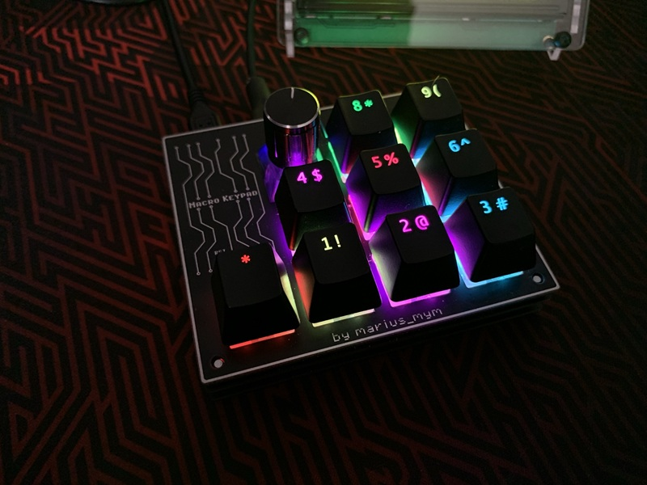
  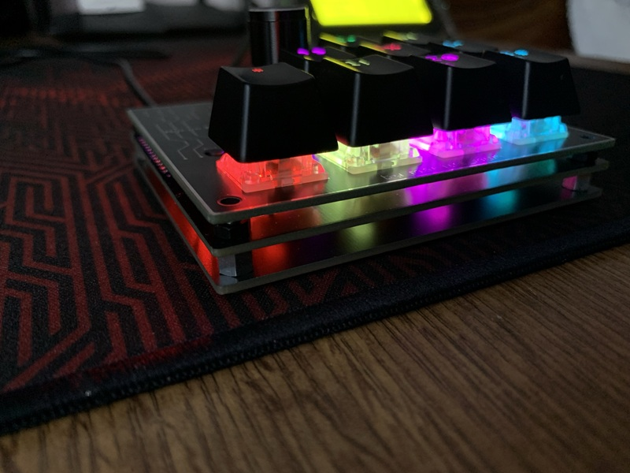

## The 5 modes from the sketch (you can change them as you like)

Press the **mode button** to cycle through them. Each mode has its own LED colors, so you always know where you are.

| Mode | What it does | Encoder |
|---|---|---|
| **1. General** | Mute, open Chrome / Photoshop / Gmail / Word / Excel, show desktop, snipping tool, lock PC | Volume up/down |
| **2. Photoshop** | Zoom in/out, new layer, duplicate layer, invert selection, merge down/visible, show/hide grid | Volume up/down |
| **3. Excel** | Paste special, borders, format as General/Number, format cells, AutoSum, insert, function arguments | Moves the mouse |
| **4. Numpad** | Classic numeric keypad (7-8-9 / 4-5-6 / 1-2-3), with a rainbow effect | `0` / `000` |
| **5. Mouse mover** | Moves the mouse back and forth automatically, so your PC never goes to sleep. *You know what it's for.* 😏 | – |

Mode 5 is strictly for keeping your screen awake during long downloads. Obviously... And if the IT department at work ever asks what's with the Arduino plugged into your PC, just tell them it's for the numpad. Everybody knows a mechanical numpad is always better. 

### Add your own modes ➕
 
Five modes are just the starting point. Adding one takes three steps:
 
1. In `loop()`, add a new `case 5:` to the `switch (modePushCounter)` block, with your own key actions (copy one of the existing modes and edit it).
2. In `checkModeButton()`, raise the limit in `if (modePushCounter > 4)` to match the number of modes (e.g. `> 5` for six modes).
3. Optionally, give it its own LED colors with `setColorsModeHUE(...)` and its own screen text, like the other modes.
   
A mode for your favorite game, your video editor, Zoom meetings, or a button that just types "LGTM" – it's your keypad.
 
**Too lazy for steps 1–3?** Upload `MacroKeypad_sketch.ino` to Claude or ChatGPT and just tell it what you want, something like *"add a 6th mode for DaVinci Resolve with cut, ripple delete and play/pause, purple LEDs"*. It'll hand you back the updated sketch. Then flash it, test it, and pretend you wrote it yourself.

## IMPORTANT INFORMATIONS !

1. **No pick-and-place assembly for this one.** Because some components are placed differently than usual (reverse-mounted LEDs, Pro Micro on the back), **PNP files are not provided** and the board has to be **assembled by hand**. Bring a steady hand, good flux and patience.

2. **DO NOT solder the Pro Micro on top of the PCB!** It goes on the **back** side, as shown in the renders. The silkscreen says so too, in capital letters, because it really means it.

3. **Using the OLED?** The top plate has a break-away section above the display: **snap it off and smooth the edges with a file**.

4. **Set the I2C voltage jumper** (5V / 3.3V) to match your display before connecting it.

5. **The default sketch is set up for a 20x4 I2C LCD.** If you use the 0.91" OLED, uncomment the U8g2 sections in the sketch and comment out the LCD ones (it's all marked in the code).

  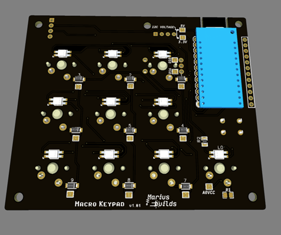
  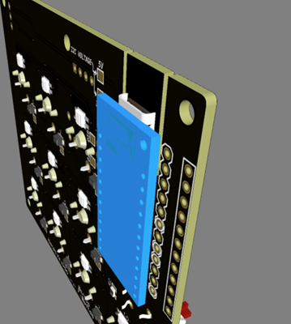

## Parts you'll need
 
**From AliExpress** (not available on LCSC, so order these separately):
 
- **Arduino Pro Micro** (ATmega32u4, **5V**, micro-USB or USB-C): [AliExpress](https://www.aliexpress.com/w/wholesale-pro-micro-atmega32u4.html)
- **10x MX switches** (9 keys + the mode key) and keycaps: [AliExpress](https://www.aliexpress.com/w/wholesale-mx-switch.html)
- **10x SK6812 MINI-E RGB LEDs**: [AliExpress](https://www.aliexpress.com/w/wholesale-sk6812-mini-e.html)
- **Optional:** 0.91" SSD1306 128x32 OLED display: [AliExpress](https://www.aliexpress.com/w/wholesale-ssd1306-oled--0.91-display-128x64-.html), or a 20x4 I2C LCD [AliExpress](https://www.aliexpress.com/w/wholesale-20x4-lcd-display.html).
- 
**From LCSC:**
 
| Part | Component | Qty | LCSC |
|---|---|---|---|
| Diodes | 1N4148W (SOD-123) | 9 | [C369920](https://www.lcsc.com/product-detail/C369920.html) |
| Resistor | 1kΩ (0805) | 1 | [C149504](https://www.lcsc.com/product-detail/C149504.html) |
| Resistor | 330Ω (0805) | 1 | [C105877](https://www.lcsc.com/product-detail/C105877.html) |
| RST button | HRO K2-1102DP | 1 | [C136684](https://www.lcsc.com/product-detail/C136684.html) |
| Rotary encoder (optional) | Bourns PEC11R-4015F-S0024 | 1 | [C143789](https://www.lcsc.com/product-detail/C143789.html) |
 
Full BOM: [`BOM_macroKeypad.csv`](/GERBER%2C%20BOM/BOM_macroKeypad.csv) (also in the **GERBER, BOM** folder).
 
**Mechanical parts:**
 
- **5mm spacers** between the bottom plate and the main PCB
- **5x M3 screws (10–12mm)** and **5x M3 nuts**
- A knob for the encoder, and rubber feet for the bottom plate (optional, but your desk will thank you)
  
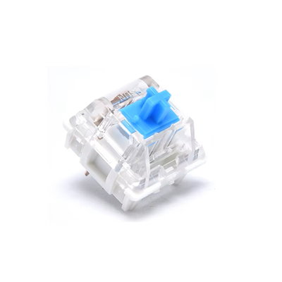

## Assembly

Check all the photos first (yes, again). Then:

1. Solder the **SK6812 Mini-E LEDs** and the other SMD parts on the main PCB.
2. Solder the **Pro Micro on the back** of the PCB, as shown in the renders.
3. Fit the **top plate**, then push the **switches** through the top plate into the main PCB and solder them. (If you're using the encoder, it goes in place of switch 1.)
4. Add the **5mm spacers** between the main PCB and the **bottom plate**, and bolt the whole sandwich together with the **M3 screws and nuts**.
5. Stick on the rubber feet, add keycaps, and flash the sketch.

  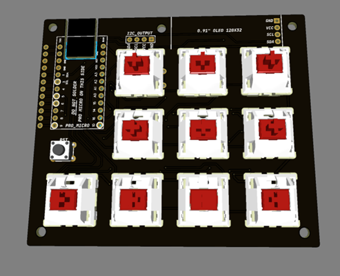
  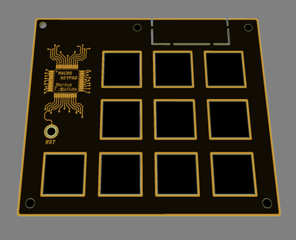

  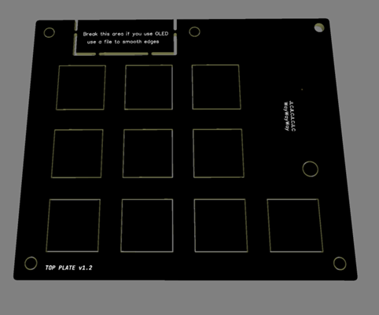
  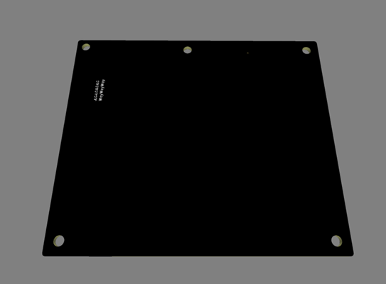

## Programming

1. Install these libraries from the Arduino Library Manager:
   - **Keypad** (by Mark Stanley & Alexander Brevig)
   - **Encoder** (by Paul Stoffregen)
   - **Adafruit NeoPixel**
   - **LiquidCrystal I2C** (for the 20x4 LCD) or **U8g2** (for the OLED)
   - **Keyboard** and **Mouse** come with the Arduino IDE.
2. Select **Arduino Leonardo** or **SparkFun Pro Micro** as the board (5V / 16MHz) and the correct COM port.
3. Open `SKETCH/MacroKeypad_sketch/MacroKeypad_sketch.ino` and upload.

### Pinout (from the sketch)

| Function | Pin |
|---|---|
| Key matrix rows | 4, 5, A3 |
| Key matrix columns | 6, 7, 8 |
| Mode button | A0 |
| RGB LEDs (data) | A2 |
| Rotary encoder | 10, 16 |
| Potentiometer (mouse speed) | A1 |
| I2C display | SDA (2), SCL (3) |

### Make it yours

Every key in every mode is a simple `case` in the sketch, so changing a shortcut takes about 30 seconds. The comment block at the top of the sketch explains `Keyboard.press()`, `Keyboard.print()`, `Mouse.move()` and friends. One button that types your 40-character password is just one `Keyboard.println()` away (we didn't recommend it, you came up with it yourself).

The keypad can also run **QMK**, but you'll lose the display functionality.

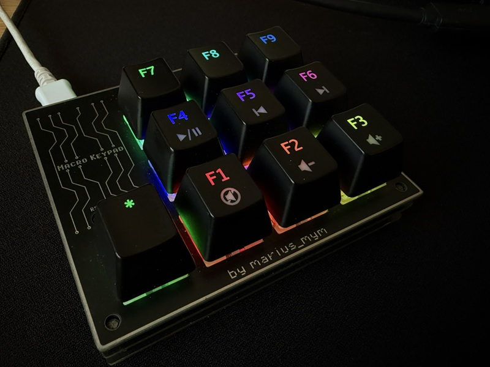

## Repository content

- **GERBER, BOM** – Gerbers for the **main PCB**, the **top plate** and the **bottom plate**, plus the BOM. (No PNP file, see above.)
- **SCHEMATIC** – the schematic in PDF.
- **SKETCH** – the Arduino sketch (v3.4.3) with all 5 modes.
- **Images** – renders and photos. **Look at all of them!**

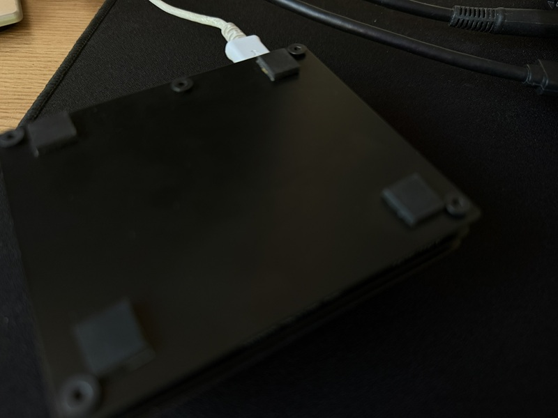

## If you want to edit the PCB

**Project can also be found here:** https://www.pcbway.com/project/shareproject/Macro_Keypad_8f98031d.html

## Credits

The sketch is based on the macro keypad code by **Ryan Bates (RetroBuiltGames)**. Thanks for sharing it with the community!

## License

This project is licensed under [Creative Commons Attribution-ShareAlike 4.0 International](https://creativecommons.org/licenses/by-sa/4.0/).

- ✅ **Share** – copy and redistribute it in any medium or format
- ✅ **Adapt** – remix, transform, and build upon it
- 🏷️ **Attribution** – give credit and link back here
- 🔁 **ShareAlike** – if you remix it, share your version under the same license

## Donate ☕

If you'd like to say thanks or buy me a coffee, a **[PayPal donation](https://www.paypal.com/donate/?hosted_button_id=KHR7DYJP2Z8QJ)** is always appreciated!

Have fun and enjoy it ! 😊
